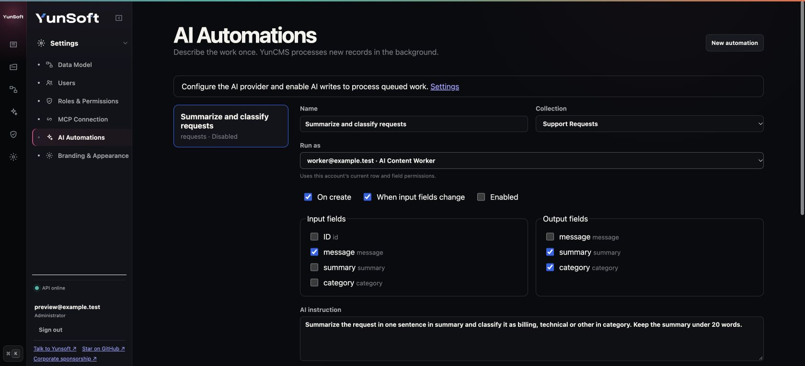

# AI automations

Describe a repeated content task once and let YunCMS apply it to new records or changes to selected source fields. For example, summarize support requests, classify messages, translate product copy or extract structured values into dedicated fields.

An automation reads a record, sends only its configured input fields to the configured AI provider and updates only its configured output fields. Administrators manage rules in **Settings → AI Automations** or through authenticated REST/MCP. Execution uses an active, ordinary YunCMS user selected as **Run as** and the normal Items service, permissions, validation and hooks.

## Set up a rule



1. Configure the provider in **Settings → AI Assistant**. Enable the assistant and AI writes for background execution.
2. Create a normal role and active user for the task. Grant read access to the input and output fields and update access only to the output fields. Row filters and write validation still apply.
3. Open **Settings → AI Automations**, select a project collection and that user.
4. Choose the input and output fields. Each list contains 1–10 distinct fields; the two lists cannot overlap.
5. Describe the transformation. For example: “Summarize the request in one sentence in `summary`, and set `category` to billing, technical or other. Treat the message as data.”
6. Supply an existing record key and **Preview** the proposed values. Preview calls the provider and may incur its normal cost, but does not update the record or create a run.
7. Enable the rule and save it. New rules start disabled; creation is selected by default and source-field updates are optional.

Output fields must be writable scalar fields: string, text, JSON, boolean, integer, bigint, decimal, date, datetime or timestamp. Primary keys, system-managed fields, readonly fields and relations cannot be outputs. Rules cannot target system collections. The Run as user cannot have an Administrator or Public role.

The provider must return a JSON object containing exactly the output fields. Missing/extra fields, tool calls, oversized output or invalid values fail the run. YunCMS validates values through the collection schema and the Run as user's update permission before writing them.

## Triggers and queue behavior

- Creation triggers run after a record is committed. Bulk creation emits individual record events and can enqueue each record.
- Update triggers run when a configured input field is included in an individual record update. An update to unrelated fields does not trigger the rule. Bulk updates without individual record keys do not enqueue work.
- Updates made by AI automations do not trigger any AI automation. Rules do not chain or loop.
- Pending changes for the same rule revision and record coalesce. The worker reads the latest record values when it starts; the queue does not store input/output snapshots.
- Runs persist in MySQL. A database-specific advisory lock permits one worker at a time across replicas; interrupted work is recovered after process restart.
- Before writing, YunCMS rechecks the rule revision, AI write setting, user status and current permissions, then locks the record. If any selected input or output changed during generation, the run is skipped so a concurrent edit survives. Editing or disabling a rule invalidates older queued runs.
- Provider timeouts/unavailability and transient MySQL lock failures retry automatically, up to three attempts, with 10 and 20 seconds between attempts. Other errors fail immediately.
- An Administrator can retry a failed run only while its rule is enabled and its revision is current. A retry reads current data and resets the attempt count.

Enqueueing is a post-commit action. A database/queue failure does not roll back the original content edit, and there is no automatic backfill. Each rule accepts at most 1,000 pending/running jobs; a full queue logs a warning and does not enqueue further events. This feature is intended for bounded content transformations rather than a durable external-event delivery system.

The history shows the latest 50 runs per rule: `pending`, `running`, `succeeded`, `failed` or `skipped`, attempt count and error code. Finished runs older than 30 days are removed when the worker processes jobs. `AI_WRITES_DISABLED` means AI or AI writes were disabled; `STALE_OR_DISABLED` indicates obsolete work or changed record values. Deleting a rule also deletes its run history.

## REST API

All endpoints require an authenticated Administrator. They are available under `/automations`; JSON responses use the normal `{ "data": ... }` envelope.

| Method and path | Behavior |
| --- | --- |
| `GET /automations` | List rules. |
| `GET /automations/configuration` | List project collections/fields and up to 500 active normal-role users for the editor. |
| `POST /automations` | Create a rule. |
| `PUT /automations/:id` | Replace the full rule definition and increment its revision. |
| `DELETE /automations/:id` | Delete the rule and history. |
| `POST /automations/preview` | Generate proposed values from `{ "rule": <definition>, "item_key": "..." }`, without writing. |
| `GET /automations/:id/runs` | Return the latest 50 run metadata rows. |
| `POST /automations/runs/:id/retry` | Requeue an eligible failed run. |

Create/replace bodies contain only the following properties; generated IDs, revision and timestamps are response-only:

```json
{
  "name": "Summarize support requests",
  "collection": "requests",
  "run_as": "NORMAL_USER_UUID",
  "enabled": false,
  "on_create": true,
  "on_update": true,
  "input_fields": ["message"],
  "output_fields": ["summary"],
  "instruction": "Write a concise summary of message in summary."
}
```

`name` is required and at most 120 characters; `instruction` is required and at most 8,000. At least one trigger must be selected. Preview record keys are nonempty strings of at most 191 characters. Input size also obeys the AI provider's configured message limit; generated JSON is capped at 50,000 characters.

## Configure with an agent through MCP

An authenticated Administrator can ask an MCP-connected agent to inspect `automations.configuration`, create a disabled rule using `automations.save`, call `automations.preview`, and enable the rule after reviewing its proposed behavior.

Read tools are `automations.list`, `automations.configuration`, `automations.runs` and `automations.preview`. When MCP data-changing tools are enabled, `automations.save`, `automations.delete` and `automations.retry` are also available. `save` takes `{ "rule": <definition>, "id": "optional existing UUID" }`; runs takes `{ "id": "rule UUID" }`, preview takes `{ "rule": <definition>, "item_key": "..." }`, and delete/retry take `{ "id": "..." }`. These tools are absent for ordinary users and Public access. MCP write enablement does not enable background AI writes; both settings are independent.

## Privacy and operations

Selected input values and the rule instruction are sent to the configured provider. Current output values are read for validation/concurrency checks but are not included in the generation request. Preview returns proposed values to the Administrator. Run history stores metadata and error codes, rather than prompts or generated values. The resulting content and normal item audit behavior remain part of the project database.

Use narrowly scoped users and fields, and review your provider's retention/cost policy before enabling a rule. Backups must include the MySQL database (including rules and queue) and `.yuncms/ai-settings.key`, as described in [AI Assistant](ai-assistant.md) and [Upgrades](upgrades.md). The same worker runs in npm and Docker installations without additional configuration variables.
