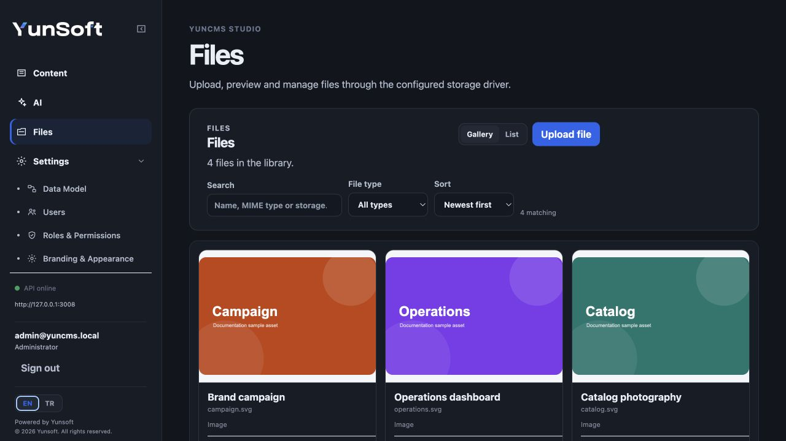

# Files and Storage

YunCMS Files combines metadata stored in MySQL with binary objects stored by a registered storage driver. The built-in drivers are local filesystem storage and S3-compatible object storage.

Files can be managed from Studio's **Files** screen or through the REST API. File/Image fields in project collections store a UUID that points to a Files record.



## Permissions

Files is an explicitly permission-managed system resource. It is not restricted to Administrator-only use.

Use the `yuncms_files` resource in role permissions to grant the actions a role needs:

- `read` — list metadata, read metadata and download content;
- `create` — upload files;
- `update` — edit permitted file metadata;
- `delete` — remove permitted files.

The Public role can also receive an intentional Files read grant. This is useful for public image galleries, public downloads or site assets. Public access remains deny-by-default until you create that permission.

Files read permissions can include a row filter, so a public or normal role can expose only a bounded subset of file records rather than the entire library. The same effective read permission is enforced for `/files/:id/content`; hiding metadata while leaving the binary publicly readable is not a bypass:

- missing session or invalid bearer token returns HTTP 401;
- denied role permission returns HTTP 403;
- files filtered out by row permissions (as well as unknown IDs) return HTTP 404 so unauthorized callers cannot probe or detect files outside their grant;
- denied or unauthorized responses never disclose private content validators (`ETag`), `Last-Modified` timestamps, or storage representation headers.

Administrative/system accountability can perform maintenance operations such as reconciliation.

See [Roles and permissions](permissions.md).

## Studio Files library

Open **Files** in Studio to browse uploaded assets. The Files workbench is designed as an asset browser: gallery view prioritizes previews while list view gives more room to filenames and storage metadata.

The category rail provides live counts for:

- all files;
- uploads from the last 7 days;
- images;
- video;
- audio;
- PDF files;
- other file types.

The recent category is calculated from `uploaded_at` and is only a view filter. It does not change or tag the underlying Files record.

Use search to match title, download filename, MIME type or storage metadata. Sorting and pagination apply to the filtered library.

Selecting an asset opens a quick inspector with its preview and metadata without replacing the current library. Use the full detail action when you need the dedicated file route or metadata editor.

### Uploading from Studio

You can choose multiple files or drop files onto the usable Files workspace. Dropping files stages them for upload; YunCMS does not silently upload a dropped file before you explicitly start the upload.

The upload queue uses the existing one-file upload endpoint for each queued file and reports real request states:

- queued;
- uploading;
- done;
- failed.

If only some files fail, successful items remain successful and failed items stay available for retry. Studio does not display a synthetic percentage when the request layer has no byte-level progress value.

Typical workflow:

1. choose files or drop them onto the Files workspace;
2. review the staged upload queue;
3. start the upload;
4. retry any failed queue items if necessary;
5. set human-facing title/download filename metadata when needed;
6. preview or download assets from the library;
7. select an asset from a collection field whose interface is `file` or `image`.

The current role determines whether Upload, Edit, Download and Delete actions are available.

Deleting a Files record is a real storage operation, not merely hiding the asset from Studio.

## REST endpoints

```text
GET    /files
POST   /files
POST   /files/reconcile
GET    /files/:id
HEAD   /files/:id/content
GET    /files/:id/content
PATCH  /files/:id
DELETE /files/:id
```

Authenticated requests normally send:

```http
Authorization: Bearer <access-token-or-api-token>
```

If the Public role has the required read permission, the read/content endpoints can also be used without a Bearer token.

## Upload a file

Upload bytes directly instead of base64-encoding them in JSON:

```bash
curl 'http://localhost:3008/files?storage=local' \
  -X POST \
  -H 'Authorization: Bearer YOUR_TOKEN' \
  -H 'Content-Type: application/octet-stream' \
  -H 'X-Filename: product-photo.png' \
  -H 'X-Mimetype: image/png' \
  -H 'X-Title: Product photo' \
  --data-binary '@./product-photo.png'
```

Upload headers:

```text
X-Filename: URL-encoded user-visible filename
X-Mimetype: MIME type
X-Title: optional human title
```

Choose a registered driver with the `storage` query parameter:

```text
POST /files?storage=local
POST /files?storage=s3
```

The request body is capped by `FILES_MAX_UPLOAD_BYTES`; an oversized body returns HTTP 413.

YunCMS generates the physical object key. User-visible filenames are metadata and do not become arbitrary filesystem paths.

## List and read metadata

```bash
curl 'http://localhost:3008/files' \
  -H 'Authorization: Bearer YOUR_TOKEN'
```

Read one:

```bash
curl 'http://localhost:3008/files/FILE_ID' \
  -H 'Authorization: Bearer YOUR_TOKEN'
```

Only records allowed by the effective Files read permission/row filter are returned.

## Download content

```bash
curl 'http://localhost:3008/files/FILE_ID/content' \
  -H 'Authorization: Bearer YOUR_TOKEN' \
  --output downloaded-file.bin
```

Built-in storage drivers stream downloads through the YunCMS API. This keeps the Files permission check authoritative for both local and S3-compatible storage while streaming chunks with backpressure.

### Streaming and HTTP byte ranges

`GET /files/:id/content` and `HEAD /files/:id/content` authorize the request and resolve content metadata before reading physical storage or parsing range headers.

- **Full GET (HTTP 200)**: returns streamed content with `Accept-Ranges: bytes`, `Content-Length`, `Content-Type`, `Content-Disposition`, strong `ETag`, and `Last-Modified` (when available).
- **Single byte range (HTTP 206 Partial Content)**:
  - Supports standard inclusive ranges (`Range: bytes=0-499`), open-ended ranges (`Range: bytes=500-`), and suffix ranges (`Range: bytes=-500`).
  - End clamping: if the requested end position is greater than or equal to the file size, it is clamped to `filesize - 1`.
  - Responses include `Accept-Ranges: bytes`, `Content-Range: bytes <start>-<end>/<total>`, and `Content-Length` reflecting the byte slice length.
- **Unsatisfiable range (HTTP 416 Range Not Satisfiable)**:
  - Returned when `start >= filesize` or for any range request against an empty (0-byte) file.
  - Responses include `Accept-Ranges: bytes`, `Content-Range: bytes */<total>`, `Content-Length: 0`, and an empty body.
- **Malformed, unknown unit, or multi-range requests**:
  - Syntactically invalid ranges, non-byte units, and multi-range requests (comma-separated ranges) are ignored and return the full HTTP 200 representation.
- **HEAD requests (`HEAD /files/:id/content`)**:
  - HEAD requests ignore `Range` headers and return full HTTP 200 representation headers (`Content-Length` of the entire file, `Accept-Ranges`, `ETag`, `Last-Modified`) without opening or reading the physical body stream.
- **Conditional ranges (`If-Range`)**:
  - Evaluated according to [RFC 9110 Section 13.1.5](https://www.rfc-editor.org/rfc/rfc9110.html#name-if-range).
  - Strong entity tags (`ETag`): must exactly match the representation's strong ETag. Weak entity tags (`W/"..."`) MUST NOT be used for subrange requests and cause the server to return the complete HTTP 200 representation. Mismatched strong ETags also return HTTP 200.
  - HTTP-date validators: must match the representation's `Last-Modified` timestamp to exact second precision per RFC 9110 (not `<=`). Recognized HTTP-date formats (such as IMF-fixdate) are compared; non-HTTP dates (such as ISO 8601 strings, numeric timestamps, or malformed strings) and mismatched dates cause the server to return the complete HTTP 200 representation.

- **Conditional requests (`If-None-Match`, `If-Modified-Since`)**:
  - Evaluated against representation metadata after authorization.
  - When fresh (`req.fresh`), the server responds with HTTP 304 (Not Modified) without a body, without `Content-Length`, and without opening a content stream.
  - `If-Range` remains separate and governs whether to return a 206 partial slice or the full 200 representation.
  - Unauthorized requests are rejected (HTTP 401/403) before metadata or headers are generated, preventing validator leakage to unauthorized callers.
- **Immutable content assumption and validator generation**:
  - File binary content is assumed to be immutable once stored.
  - Strong entity tags (`ETag`) use the provider's valid RFC 9110 strong ETag when available.
  - Otherwise, YunCMS generates a native strong ETag based on the unique file ID, safe integer byte size, and modification timestamp in milliseconds: `"<id>-<sizeHex>-<mtimeMsHex>"`. Representation `Last-Modified` headers use standard HTTP-date second precision.

### Media CORS contract

For web browsers loading media (such as audio, video, or streamed documents) across origins from the configured Studio/client origin (`STUDIO_ORIGIN`):

- **Preflight (`OPTIONS`)**: allows `GET`, `HEAD`, `POST`, `PUT`, `PATCH`, `DELETE`, `OPTIONS` methods, and accepts headers `range`, `if-range`, `if-none-match`, `if-modified-since`, `authorization`, `content-type`, and request metadata headers.
- **Exposed headers**: cross-origin responses from the configured origin expose `ETag`, `Content-Range`, `Accept-Ranges`, and `Last-Modified` (`Access-Control-Expose-Headers`), enabling browsers and media players to inspect byte-range support and content identity.
- **Unconfigured origins**: requests from unconfigured or untrusted origins do not receive `Access-Control-Allow-Origin` or exposed headers. Authentication and row-level Files permission checks remain authoritative on the server.

### Programmatic access in FilesService

- `readContent(id)` — legacy Buffer API; retrieves file metadata and loads complete binary contents into a Buffer (`{ file, contents }`).
- `readContentInfo(id)` — authorized metadata method; verifies read access and queries physical `driver.stat()` to return safe integer `size`, `modifiedAt`, and strong `etag` without reading or buffering the file body (`{ file, size, modifiedAt, etag }`).
- `readContentStream(id, { start, end } = {})` — authorized streaming method; verifies read permissions, validates physical byte bounds, and returns a Node Readable stream (`{ file, stream, size, modifiedAt, etag }`).

## Update metadata

```bash
curl 'http://localhost:3008/files/FILE_ID' \
  -X PATCH \
  -H 'Authorization: Bearer YOUR_TOKEN' \
  -H 'Content-Type: application/json' \
  -d '{"title":"Homepage hero image"}'
```

The current role must have Files update access to the target record.

## Delete

```bash
curl 'http://localhost:3008/files/FILE_ID' \
  -X DELETE \
  -H 'Authorization: Bearer YOUR_TOKEN'
```

YunCMS removes the metadata and then cleans up the storage object. If metadata deletion succeeds but storage cleanup fails, the API reports `FILE_STORAGE_CLEANUP_FAILED` so operators can investigate the orphan instead of silently ignoring it.

File lifecycle operations emit `files.create`, `files.update` and `files.delete` events for trusted extension/audit consumers.

# Storage drivers

## Local storage

```env
FILES_LOCAL_ROOT=uploads
FILES_MAX_UPLOAD_BYTES=26214400
```

The default upload limit is 25 MiB.

Projects created by `yuncms init` use the generated project-local `uploads/` directory. The core runtime fallback is `.yuncms/uploads` only when `FILES_LOCAL_ROOT` is omitted entirely; keep an explicit value in production so operators and backup jobs agree on the location.

The local driver restricts physical keys to safe single-segment storage keys and checks path containment before filesystem access. If you use local storage in production, the upload directory is production data and must be included in backup/restore procedures.

## S3-compatible storage

```env
S3_BUCKET=your-bucket
S3_REGION=us-east-1
S3_ENDPOINT=
S3_ACCESS_KEY_ID=
S3_SECRET_ACCESS_KEY=
S3_FORCE_PATH_STYLE=false
```

When `S3_BUCKET` is configured, YunCMS registers an `s3` driver in addition to `local`.

Custom endpoints and path-style addressing allow compatible object-storage providers. If explicit access-key variables are omitted, the AWS SDK credential chain can be used where the deployment environment provides credentials.

## Storage contract for extensions

Built-in storage drivers implement the runtime operations needed by Files:

```text
put(key, contents)
get(key)
delete(key)
stat(key)
getSignedUrl(key)
getStream(key, { start, end }) // optional
```

- `getStream(key, { start, end } = {})`:
  - `LocalStorageDriver` streams directly via `fs.createReadStream` with bounded chunk buffers (`highWaterMark`) and optional inclusive `{ start, end }`.
  - `S3StorageDriver` passes the requested byte range to `GetObjectCommand` via AWS SDK's `Range` header and returns the Node `Readable` body without buffering.
  - Optional contract: `getStream` is optional for custom or legacy storage drivers. When implemented, it must return a Node `Readable` stream. When omitted, `FilesService.readContentStream()` automatically falls back to buffering via `get()` and returns a `Readable` stream for the full content or requested subrange (`subarray(start, end + 1)`).
  - Metadata HEAD requests query `stat()` only; they never call `get()` or `getStream()`.

Built-in local and S3 drivers also support inventory listing used by reconciliation. A storage implementation that cannot list inventory fails reconciliation explicitly rather than pretending the storage has no orphan objects.

# Reconciliation

`POST /files/reconcile` compares Files metadata with a storage inventory. It is an administrative maintenance operation and is dry-run by default.

```bash
curl 'http://localhost:3008/files/reconcile' \
  -X POST \
  -H 'Authorization: Bearer ADMIN_TOKEN' \
  -H 'Content-Type: application/json' \
  -d '{
    "storage":"local",
    "deleteOrphans":false,
    "minimumAgeMs":3600000
  }'
```

The result identifies:

- metadata records whose object is missing;
- storage objects without metadata;
- orphan objects old enough to be eligible for cleanup;
- objects actually deleted when destructive cleanup is requested.

Safety behavior:

- reconciliation never automatically deletes database metadata simply because a storage object is missing;
- `deleteOrphans` defaults to false;
- orphan deletion requires known modification time and the requested/default minimum age;
- the default one-hour age guard protects the upload window where object storage is written before metadata is committed;
- inventories above the bounded maintenance limit are rejected instead of processed without a limit.

Treat reconciliation as a drift-repair tool, not a substitute for backups or storage monitoring.

# Public gallery example

For a public website gallery, a common pattern is:

1. grant the Public role `read` on `yuncms_files`;
2. add a restrictive Files row filter that matches only assets intended for public use;
3. store those Files UUIDs in your gallery/content collection;
4. grant Public read access to that collection too;
5. fetch collection records and their file ids from your frontend, then request `/files/:id/content`.

Do not grant unrestricted Public Files read merely because one image must be public.

## Related guides

- [Roles and permissions](permissions.md)
- [Data model](data-model.md)
- [REST API](rest-api.md)
- [Configuration](configuration.md)
- [Deployment](deployment.md)
