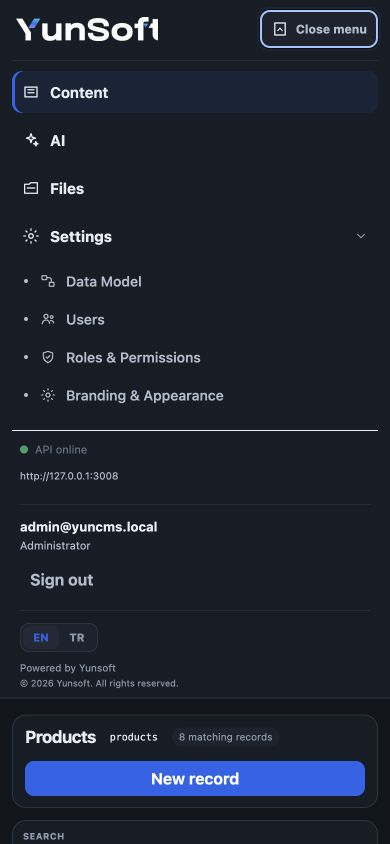
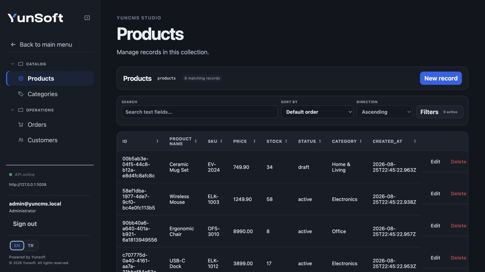
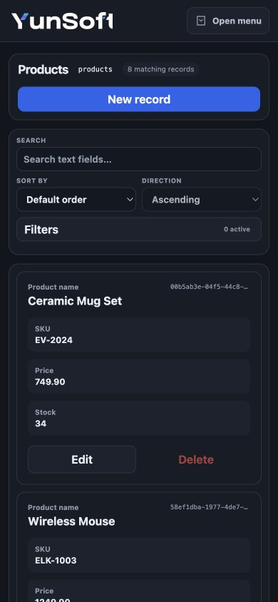
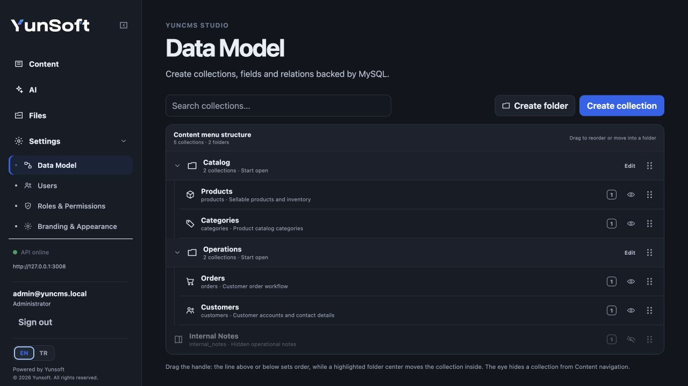
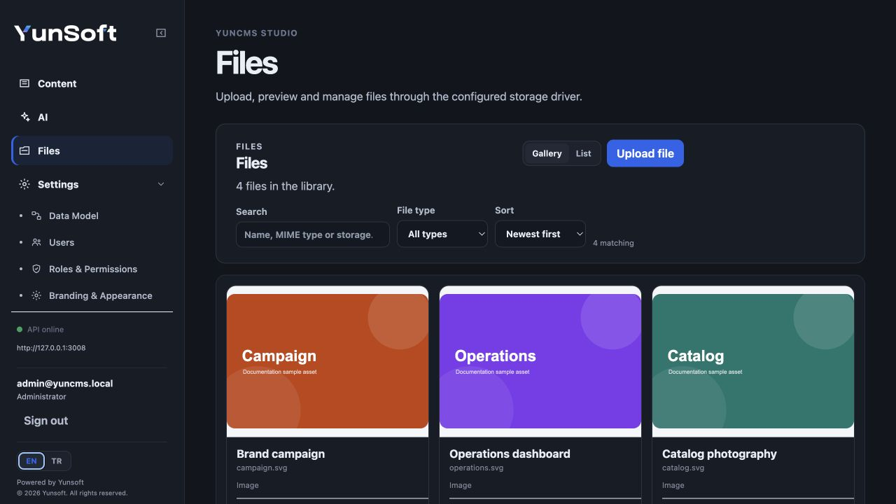
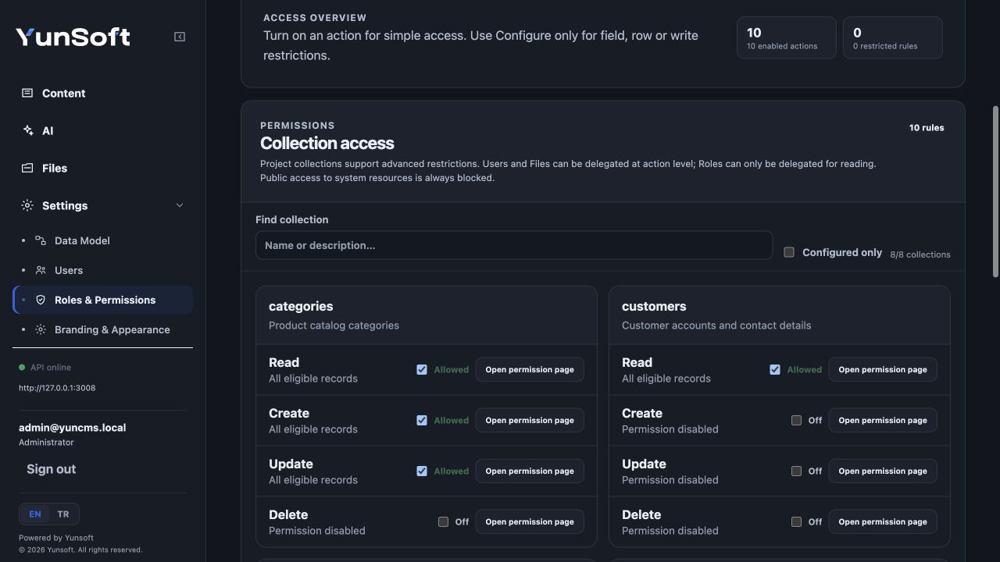

# Using YunCMS Studio

YunCMS Studio is the browser administration interface for content, data models, Files, users, roles, permissions, appearance and the built-in AI assistant. In a normal installation Studio and the REST API use the same origin and port.

After starting YunCMS, open the configured URL, usually:

```text
http://localhost:3008
```

If this is your first installation, complete [Getting Started](getting-started.md) before using this page as a feature reference.

## Sign in

The login screen supports normal email/password authentication and displays any configured external authentication providers. When an Administrator enables public registration, it also exposes account creation and the optional verification-resend flow.

If you forget a local password, use the password-reset option. Reset and verification links return to Studio and are completed against the normal authentication API.

Studio keeps opaque session credentials in browser session storage, refreshes an expired access token when possible and sends you back to login if the session can no longer be refreshed.

See [Authentication](auth.md) to configure OIDC, OAuth2, LDAP or SAML login methods.

# Navigation

The main sidebar is task-oriented:

- **Content** — project collections that are visible in the content menu;
- **Library / Files** — uploaded assets;
- **Settings** — Data Model, Users, Roles & Permissions, Branding & Appearance and Administrator-only MCP settings available to the current account.

The visible navigation is not an authorization boundary. Roles and permissions decide what a user can actually read or change.

On narrow screens, Studio replaces the desktop sidebar with an **Open menu** button. Opening it exposes the same sections, account status and language controls without changing the current page.

<p align="center">
  
</p>

## Organize collections

Data Model lets you organize content navigation with one-level folders and ordering. Folders affect presentation only; they do not create database tables or relations.

Collections can be:

- reordered;
- placed in a navigation folder;
- hidden from the Content menu;
- presented as singleton content when appropriate.

A hidden collection can still be accessed through the API if the caller's role has permission.

# Content

Select a collection directly from **Content** to work with its records.



The generic content screen provides:

- record table/list navigation;
- create records;
- edit records;
- delete records when permitted;
- form controls generated from field metadata;
- loading, empty and error states;
- search/filter/navigation controls appropriate to the screen;
- relation display/pickers for supported relation fields.

Only operations allowed by your effective role are available. If an API permission prevents an action, the backend remains authoritative even if a client attempts the request manually.

## Create a record

1. Open the collection under **Content**.
2. Choose the create/new-record action.
3. Fill the generated form.
4. Select related records where the field uses a relation picker.
5. Save.

Required fields and write-field restrictions are validated by the API. System fields such as creation/update timestamps and users are filled automatically when configured for the collection.

On mobile, records become readable cards rather than forcing the desktop table into a narrow viewport:

<p align="center">
  
</p>

## Edit a record

Open a row/record, change permitted values and save. Role field allowlists and row filters are applied again on update; viewing a page in Studio does not bypass them.

## Relations in forms

For direct many-to-one relations, Studio chooses a readable label from the target collection in this order when available:

1. `name`;
2. `title`;
3. `label`;
4. another visible string/text field;
5. target key/id.

The relation picker reads target data through the normal Items API, so target collection/row/field permissions are still enforced.

For the full relation model, including reverse and M2M querying, see [Data model](data-model.md) and [Items query language](api-query-language.md).

# Data Model

Open **Settings → Data Model** to create and maintain project collections.



## Collections

From the collection tree you can:

- create a collection;
- inspect project and system collections separately;
- change display/navigation metadata;
- control Content-menu visibility;
- mark an appropriate collection as singleton;
- delete project collections through the destructive flow;
- organize collections into one-level navigation folders;
- drag/drop to reorder collections and folders.

Display names are for humans; collection API keys are the stable identifiers used by REST, permissions and integrations. Avoid changing integration keys after external clients depend on them.

## Fields

The **Fields** tab lets you inspect/add/remove fields and adjust supported schema properties such as required/nullability.

Current storage types include:

```text
integer
bigint
decimal
string
text
boolean
date
datetime
timestamp
json
uuid
```

File and image controls use UUID-backed fields linked to the Files library.

See [Data model](data-model.md) for type limits, defaults and system fields.

## Relations

The **Relations** area supports relation lifecycle management including:

- many-to-one (M2O);
- one-to-one (O2O) where configured;
- reverse one-to-many/one-to-one views derived from stored relations;
- managed many-to-many (M2M) junctions.

Destructive M2M removal explicitly warns that junction link records are removed and calls the guarded schema endpoint with destructive intent.

# Files

Open **Files** for the media/file library.



The library supports:

- gallery view;
- list view;
- authenticated image thumbnails;
- placeholders for non-image files;
- search by title, filename, MIME type or storage metadata;
- drag/drop upload;
- file-picker upload;
- upload file name/size feedback;
- authenticated download;
- editable title/download filename metadata;
- delete when permitted.

Files is permission-managed. A non-Administrator role can receive exactly the read/create/update/delete access it needs, and the Public role can intentionally receive filtered read access for public galleries/assets.

See [Files](files.md).

# Users

Open **Settings → Users** to manage accounts when your role has user-management access.

Supported administration includes:

- list users;
- create users;
- assign/update allowed roles;
- change account status;
- inspect email-verification state;
- send verification mail when SMTP is configured;
- delete permitted users.

Protected Administrator/account invariants remain enforced by the API. Delegated user-management access is not equivalent to full Administrator access.

# Roles & Permissions

Open **Settings → Roles & Permissions** to control access.



The normal workflow is role-first:

1. select or create a role;
2. find the collection/resource;
3. toggle `Read`, `Create`, `Update` or `Delete` for simple grants;
4. open advanced rules when field, row or write validation restrictions are needed;
5. save and test with an account assigned to that role.

The permission matrix can also show explicitly delegatable system resources such as Users, Files and Roles.

## Advanced permission rules

Advanced rules support:

- field allowlists;
- row-filter JSON;
- create/update prospective-record validation JSON.

Studio validates JSON before submitting it. Validation input is relevant to create/update permissions, not ordinary read/delete grants.

The Public role uses the same explicit grant model. This makes intentional public collections and filtered public Files possible without introducing a separate hard-coded public-access system.

See [Roles and permissions](permissions.md).

# Appearance and branding

Studio branding/settings can control project-facing elements such as:

- project/site name;
- logo;
- favicon;
- accent/presentation preferences supported by the settings screen;
- navigation presentation.

Logo and favicon assets point to YunCMS Files records rather than arbitrary unvalidated asset paths.

See [Studio customization](studio-customization.md).

## Public registration

Administrators configure default-off public signup under **Branding & Appearance → Public Registration**. A normal authenticated role must be selected before signup can be enabled; Administrator and Public roles are never eligible. Email verification can be required when SMTP is configured.

See [Public registration](public-registration.md) before enabling signup.

# AI assistant

When configured by an Administrator, the Studio AI assistant can help inspect schema/content and, when explicitly allowed, perform bounded data operations through YunCMS services.

The assistant does not receive an Administrator bypass simply because it is AI. Tool calls use the current user's normal role/accountability, and write access also depends on AI-specific write/access-mode controls.

See [AI assistant](ai-assistant.md) before enabling data-changing tools.

# Running Studio

A normal installed project uses one public listener:

```bash
npx yuncms start
```

The generated process-manager entry is equivalent for hosted deployments:

```bash
node start.js
```

The Studio build is served by the YunCMS API process, so normal production deployment does not require a separate frontend web server/port.

For project setup, initialization and managed update commands, use [Setup and CLI](setup-cli.md).

# Troubleshooting common access questions

## “I can see a collection but cannot edit it”

Navigation visibility and authorization are separate. Check the current role's update permission, row filter and write-field allowlist.

## “A relation target is missing from the picker”

Check read access on the target collection and any target row filter. Relation pickers obey target RBAC.

## “A public image returns unauthorized/not found”

Check both the content collection permission and `yuncms_files:read`. If Files read has a row filter, verify that the selected Files record matches it.

## “An external sign-in button does not appear”

Check `AUTH_PROVIDERS` and the provider configuration, then verify `/auth/providers` returns the provider metadata. Browser providers also require a sufficiently long `AUTH_STATE_SECRET`.

## Related guides

- [Setup and CLI](setup-cli.md)
- [Data model](data-model.md)
- [Roles and permissions](permissions.md)
- [Files](files.md)
- [Authentication](auth.md)
- [Public registration](public-registration.md)
- [AI assistant](ai-assistant.md)
